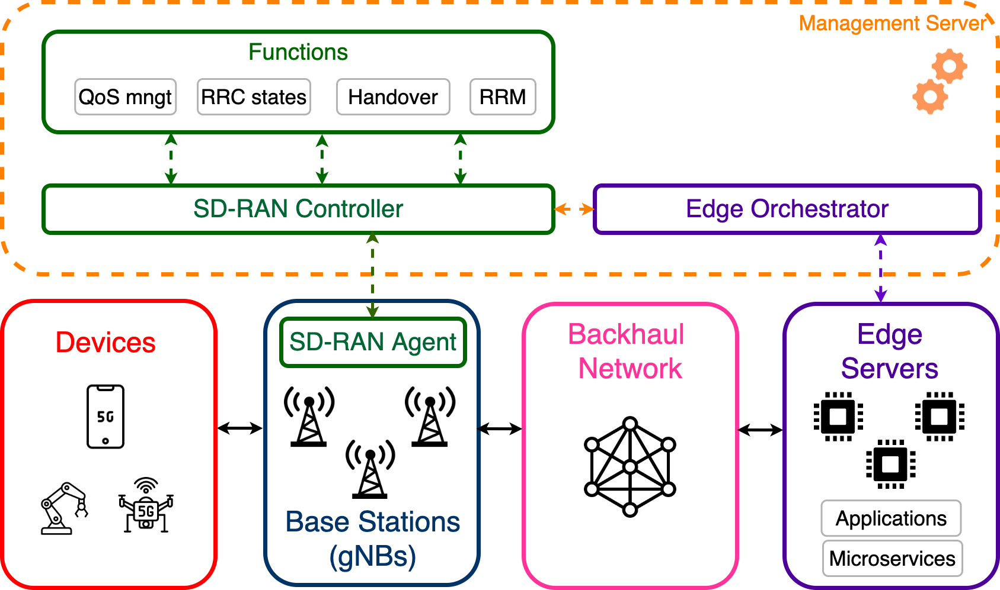

# NextGSim

NextGSim provides a simulation environment focusing on resource management aspects in mobile edge computing scenarios. It consists of mainly two parts: Radio Network simulation and Edge Computing
simulation. These two simulations are loosely connected to enable both independent and joint use.

# Simulated Architecture

The simulated architecture resembles a joint management server, where edge and radio-related information is simultaneously updated 
to the edge orchestrator and SD-RAN controller. Therefore, novel resource allocation, offloading decisions, and orchestration algorithms can be tested through NextGSim. 

  
  

    Figure 1: Relationship between NextGSim modules.
  

# Radio Simulation
The Radio Access Network (RAN) consists of the user plane and the control plane. 

<ins>RAN user plane</ins>: The user plane is responsible for creating the scenario (</ins>Scenario</ins> module), depending on the parameters provided by the user in the 
configuration file. The indoor factory scenario consists of a constant number and placement of gNBs, however, the indoor and outdoor scenarios are reconfigurable.
gNBs placement is characterized by 3D coordinates (X,Y,Z), the coverage defined by the radios of macro or micro gNBs. The </ins>Channel model</ins> module is responsible for 
generating the signal quality between the serving gNBs and the users roaming in the area covered by the gNBs. 
Meanwhile, the users are placed randomly in the scenario space, characterized by the user's coordinates (x,y,z) and by the velocity v. The velocity value of a user stays constant
during the simulation time after the initialization process. </ins>User</ins> module is responsible for the generation of the traffic patterns, user's mobility, and user radio resource
control (RRC) states.

<ins>RAN control plane</ins>:

# Edge Computing Simulation
Edge Computing part consists of 3 main modules that are Application, Entities and
Network.

<ins>Application</ins>: An application is defined by its services which form a directed
acyclic graph(DAG). Microservices can generate, receive and process messages. In such a scenario, a task is completed
when the last microservice in a DAG, processes its message. Different users can share microservices at the edge or have
a dedicated microservice for themselves.

<ins>Entities</ins>: Entities implemented are Edge Server, Orchestrator, CPU and Router. Edge servers are the computing
nodes that serves users at the edge of the network. They are controlled by the orchestrator which decides where to deploy services,
which services users need to be assigned to, forward radio related information to services and if necessary migrate services
between edge servers. 

CPU module defines the processing behaviour of the services. Different processing behaviour can be implemented
module. As a proof-of-concept example a latency aware processing algorithm is implemented, where messages from users that suffer 
higher radio link latency is prioritized, in order to increase the chance of meeting the deadline of the task.

Router is a simple entity that routes messages between entities like edge servers and base stations. Currently, it only implements
the shortest path algorithm for routing.

<ins>Network</ins>: This module implements the topology between entities and microservices. Physical entities 
are connected to each other with links that are defined by their bandwidth and latency.

# Examples
Figure 5 in our paper is a result of an experiment to assess the effect of various combinations of radio resource allocation and 
edge application queueing approaches. In order to reproduce the results, run "experiments/experiments_figure5.sh" in your terminal.
To generate the plot out of the results, run "plotting/figure5.py".

Figure 6 in our paper is a result of an experiment to assess the effect of increasing the number of application instances 
and number of users on completion rate of a task. 
In order to reproduce the results, run "experiments/experiments_figure6.sh" in your terminal.
To generate the plot out of the results, run "plotting/figure6.py".

